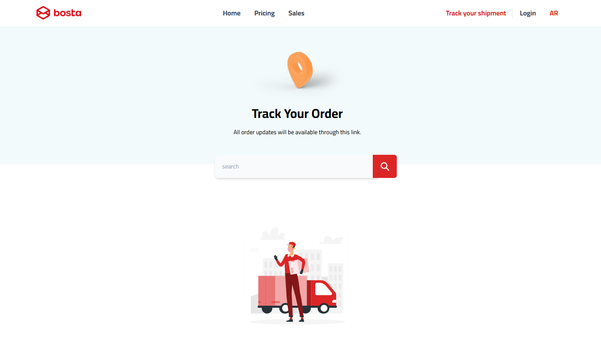

<div align="center">
  <br />
      
  <br />

  <div>
    
    
    

  </div>

<h3 align="center">Bosta Tracking Service</h3>

</div>

## 📋 <a name="table">Table of Contents</a>

1. 🤖 [Introduction](#introduction)
2. ⚙️ [Tech Stack](#tech-stack)
3. 🔋 [Features](#features)
4. 🤸 [Quick Start](#quick-start)

## <a name="introduction">🤖 Introduction</a>

This project is a Shipment Tracking Component designed to display and manage
shipment details for users. The primary functionality of this component revolves
around grouping and organizing shipment events based on their timestamps and
presenting them in a user-friendly format. Here's an overview:

## <a name="tech-stack">⚙️ Tech Stack</a>

-   React 19
-   TailwindCSS
-   TypeScript

## <a name="features">🔋 Features</a>

👉 **Date-Based Grouping**: Organizes shipment events under visually distinct
headers based on their dates for better readability and navigation.

👉 **Dynamic Event Visibility**: Automatically hides additional events
(beyond 5) under a group and includes a stylish "Show More" button for users to
reveal them.

👉 **RTL Support**: Ensures a seamless experience for Right-to-Left languages
like Arabic, with proper alignment and date formatting.

👉 **Modern Styling with TailwindCSS**: Utilizes TailwindCSS for a responsive
and visually appealing design, ensuring compatibility with different screen
sizes.

👉 **Timeline Visualization**: Each shipment event appears on a clean,
structured timeline, making it easier to follow the shipment's progress.

👉 **Light and Minimal Aesthetic**: Keeps the interface clean and
distraction-free with minimalistic styling.

👉 **Customizable Theme**: Provides the flexibility to adjust colors and themes,
allowing it to match the parent application's branding.

👉 **Collapsible Sections**: Introduces collapsible headers for date groups,
enabling users to collapse or expand shipment details as needed.

These features elevate the Shipment Tracking Component from a basic display to a
refined, user-friendly, and aesthetically pleasing tool.

## <a name="quick-start">🤸 Quick Start</a>

Follow these steps to set up the project locally on your machine.

**Prerequisites**

Make sure you have the following installed on your machine:

-   [Git](https://git-scm.com/)
-   [Node.js](https://nodejs.org/en)
-   [npm](https://www.npmjs.com/) (Node Package Manager)

**Cloning the Repository**

```bash
git clone https://github.com/ahmedosamaaa/Bosta-assessment.git
cd
```

**Installation**

Install the project dependencies using npm:

```bash
npm install
```

**Running the Project**

```bash
npm run dev
```

Open [http://localhost:5173](http://localhost:5173) in your browser to view the
project.
